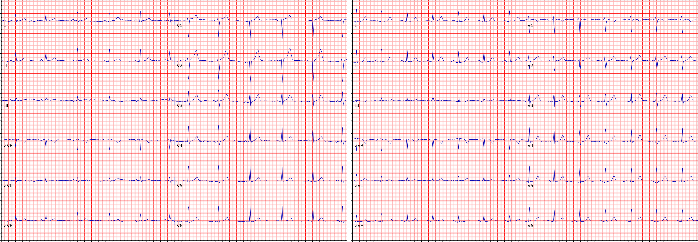
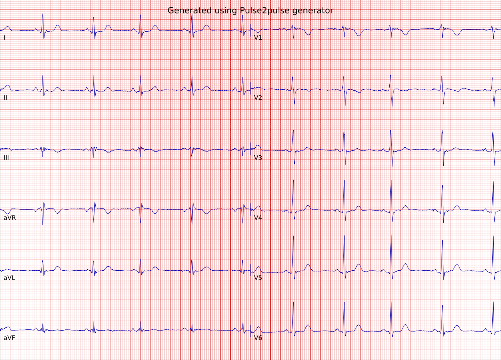

# deepfake-ecg

## [Paper](https://www.nature.com/articles/s41598-021-01295-2) | [GitHub](https://github.com/vlbthambawita/deepfake-ecg) | [Pre-generated ECGs (150k)](https://osf.io/6hved/)
---

## [Pulse2Pulse - development repo](https://github.com/vlbthambawita/Pulse2Pulse)
If you want to train the model from scratch, please refer to our development repository Pulse2Pulse.

---

Generate unlimited realistic deepfake ECGs using the deep generative model: Pulse2pulse introduced in our full paper here: https://doi.org/10.1038/s41598-021-01295-2 (DeepFake electrocardiograms: the key for open science for artificial intelligence in medicine).

## Installation

### **Option 1: Install from PyPI (if available)**

If the package is successfully published on PyPI, install it using:

```bash
pip install deepfake-ecg
```

### **Option 2: Install Locally from Source**

If the package is not yet available on PyPI, follow these steps to install it locally:

#### **1. Clone the Repository**

```bash
git clone https://github.com/vlbthambawita/deepfake-ecg.git
cd deepfake-ecg
```

#### **2. Install Dependencies and the Package**

##### **Without venv:** #####
```bash
pip install -e .
```

##### **In a venv:** #####
With venv (to be stored e.g. under ~/python-environments/deepfake-ecg):
```bash
mkdir -p ~/python-environments/deepfake-ecg
python3 -m venv ~/python-environments/deepfake-ecg
. ~/python-environments/deepfake-ecg/bin/activate
pip install -e .
```


---

## Usage

The generator functions can generate DeepFake ECGs with 8-lead values
[Lead names from the first column to the eighth column: **'I','II','V1','V2','V3','V4','V5','V6'**] for 10s (5000 values per lead). These 8-lead formats can be converted to 12-lead formats using the following equations:

```
lead III value = (lead II value) - (lead I value)
lead aVR value = -0.5*(lead I value + lead II value)
lead aVL value = lead I value - 0.5 * lead II value
lead aVF value = lead II value - 0.5 * lead I value
```

### **Run on CPU (default setting)**

```python
import deepfakeecg

deepfakeecg.generate(5, ".", start_id=0, run_device="cpu")  # Generate 5 ECGs to the current folder starting from id=0
```

### **Run on GPU**

```python
import deepfakeecg

deepfakeecg.generate(5, ".", start_id=0, run_device="cuda")  # Generate 5 ECGs to the current folder starting from id=0
```

### **Pre-generated DeepFake ECGs and corresponding MUSE reports are here:**
https://osf.io/6hved/

- In this repository, there are two DeepFake datasets:
  1. 150k dataset - Randomly generated 150k DeepFake ECGs
  2. Filtered all normals dataset - Only "Normal" ECGs filtered using the MUSE analysis report

## **A real ECG vs a DeepFake ECG (from left to right):**



## **A sample DeepFake ECG:**


## **Contributing**
Pull requests are welcome. For major changes, please open an issue first to discuss what you would like to change.

Please make sure to update tests as appropriate.

## **Citation:**
```latex
@article{thambawita2021deepfake,
  title={DeepFake electrocardiograms using generative adversarial networks are the beginning of the end for privacy issues in medicine},
  author={Thambawita, Vajira and Isaksen, Jonas L and Hicks, Steven A and Ghouse, Jonas and Ahlberg, Gustav and Linneberg, Allan and Grarup, Niels and Ellervik, Christina and Olesen, Morten Salling and Hansen, Torben and others},
  journal={Scientific reports},
  volume={11},
  number={1},
  pages={1--8},
  year={2021},
  publisher={Nature Publishing Group}
}
```

## **License**
[MIT](https://choosealicense.com/licenses/mit/)

## **For more details:**
Please contact: vajira@simula.no, michael@simula.no
